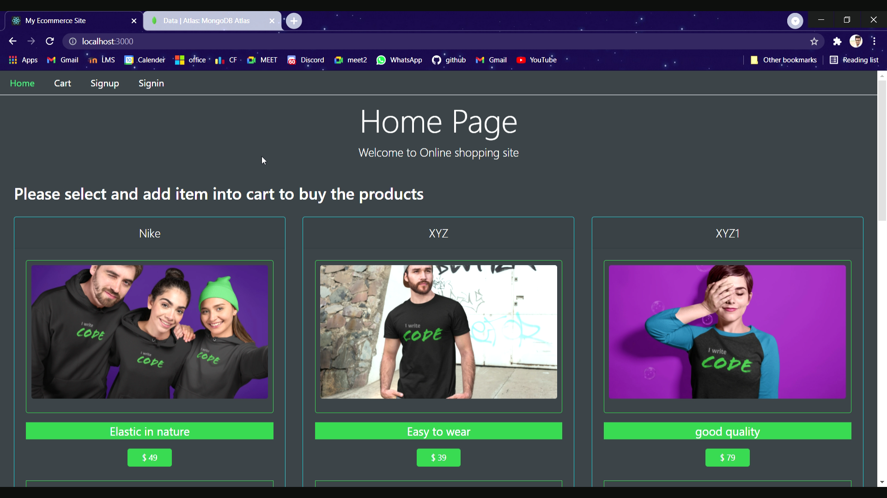

# E-commerce-site 🛒

A web application where user can add products in cart and switch via routes to access different category and save data in local storage as well as in MongoDb

## Pages

This website has following pages -

- Home
- Admin/User Dashboard
- Signin
- Signout

## Features

- Two payment methods
- Add/Remove items in cart
- Authentication
- Create/edit/delete Product
- Create/edit/delete category

## Details

- This website starts with the **home page** .

- A **product view page OR product details page** is a web page on an eCommerce site that presents the description of a specific product in view. The details displayed often include size, color, price, and customers may want to know before making a purchase.

- A **cart page** is an essential part of an e-commerce website. It is the page where users can pile up what they want to buy from the website.

- A **checkout page** is related to payment and shipping/billing details on an ecommerce store. The checkout page gives customers the opportunity to complete their order.

- A **Admin DashBoard** is a page which manages the category, products details.

- A **Signin/signout** where admin and user can login according to their right given to them.

## Tools and Technology

- HTML
- CSS
- JS
- ReactJs
- MongoDB
- ExpressJS
- NodeJS
- Stripe payment
- Paypal payment

## Demo Video
### Click on the image to checkout the video 

